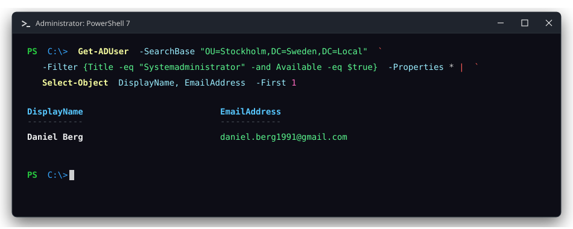
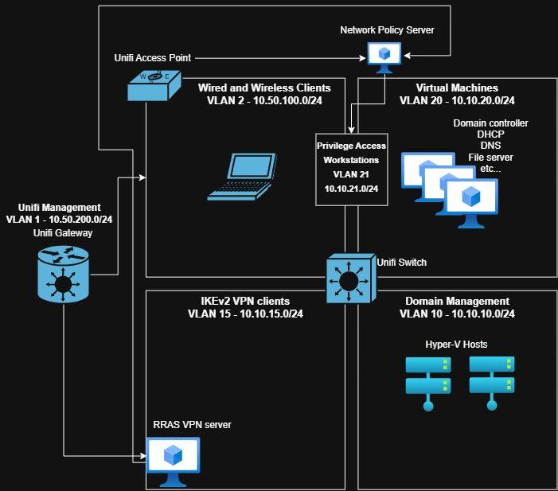

# dlb-HomeLab
Welcome to my windows server home lab overview. I love everything Windows server and PowerShell. 

# Infrastructure Homelab & Enterprise Architecture

A production-aligned Windows Server and networking lab built with a focus on High Availability (HA), automated configuration management, and zero-trust security principles.

---

## Physical & Network Infrastructure

### Physical Compute Nodes
* **2x Mini-Desktops (Singleton Hyper-V Hosts)**
  * **CPU:** AMD Ryzen 7 7745HX
  * **RAM:** 32 GB DDR5
  * **Storage:** 2x 1 TB M.2 NVMe Gen4 SSD
  * **NICs:** 4x GbE Wired NICs

### Network & Segmentation
* **Ubiquiti UniFi Ecosystem**
  * **Gateway:** Inter-VLAN routing, firewall policies, and security segmentation.
  * **Switching & AP:** 2x Managed Switches, 1x Access Point.

---

## Virtual Machines & Workloads

| Hostname | VLAN | Role / Services | Key Architectural Details |
| :--- | :--- | :--- | :--- |
| `DC1` | 20 | AD DS, DNS | FSMO Roles: Schema Master, Domain Naming Master |
| `DC2` | 20 | AD DS, DNS | FSMO Roles: PDC Emulator, RID Master, Infrastructure Master |
| `DHCP1` | 20 | DHCP Server | Primary DHCP server (Active/Standby relationship) |
| `DHCP2` | 20 | DHCP Server | Hot Standby failover partner to `DHCP1` |
| `FS1` | 20 | File Services | DFS-N (`\\Contoso\Data Files`), DFS-R, Data Deduplication, FSRM |
| `FS2` | 20 | File Services | DFS-R replication partner to `FS1` |
| `CA1` | 20 | AD CS (PKI) | Enterprise Certificate Authority |
| `CA-CRL1` | 20 | IIS Web Server | Standalone HTTP endpoint publishing `CA1` Certificate Revocation List (CRL) |
| `DSC1` | 20 | IaC / Automation | PowerShell DSC Pull Server using DFS repository & GPO targeting |
| `VPN1` | 15 | RRAS / Remote Access | P2S IKEv2 Tunnel, Let's Encrypt TLS, RADIUS auth via `NPS1` |
| `NPS1` | 20 | Network Policy Server | RADIUS Server enforcing EAP-TLS (User & Device certs) for VPN & Wi-Fi |
| `WACGW1` | 21 | Management Gateway | Windows Admin Center v2 gateway over WinRM HTTPS (Kerberos) |
| `WEC1` | 20 | Windows Event Collector | Centralized logmanagement for Active Directory |
| `AUTO1` | 21 | Script Automator Platform | Uses PowerShell scripts and Just Enough Administration endpoints to automate active directory state |
| `HVH1` | 10 | Hyper-V |Hypervisor Platform |
| `HVH2` | 10 | Hyper-V | Hypervisor Platform |

---

## Management, Hardening & Tools

### Administration & Operations
* **Remote Management:** Restricted to WinRM over HTTPS (TCP 5986), SSH, and Windows Admin Center (WACv2).
* **Configuration Management:** PowerShell Desired State Configuration (DSC) Pull Server backed by Group Policy Preferences, and a script-runner VM.
* **Windows native:** Limited to on-premises, self-hosted, windows native solutions. Using PowerShell to bridge the gap between classic windows services and modern cloud solutions.

### Security Hardening & Identity
* **Least Privilege:** Just Enough Administration (JEA) endpoints configured for delegated service management.
* **Identity & Service Accounts:** Group Managed Service Accounts (gMSA) utilized for automated services.
* **VLAN Segmentation:** Segmented network to reduce potential blast radius and to adhere to least privillege access.
* **Public Key Infrastructure:** Full AD CS environment enforcing certificate-based and Kerberos authentication across networks.
